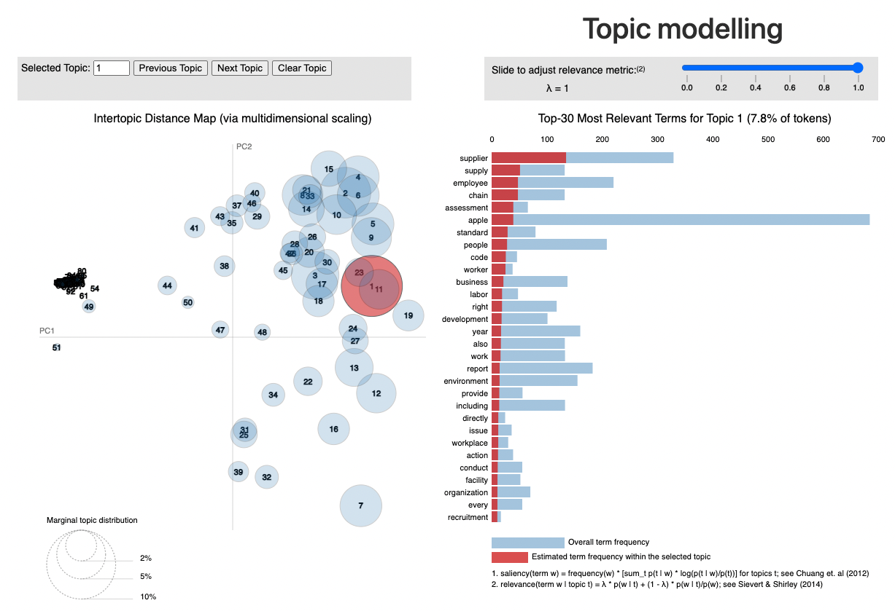
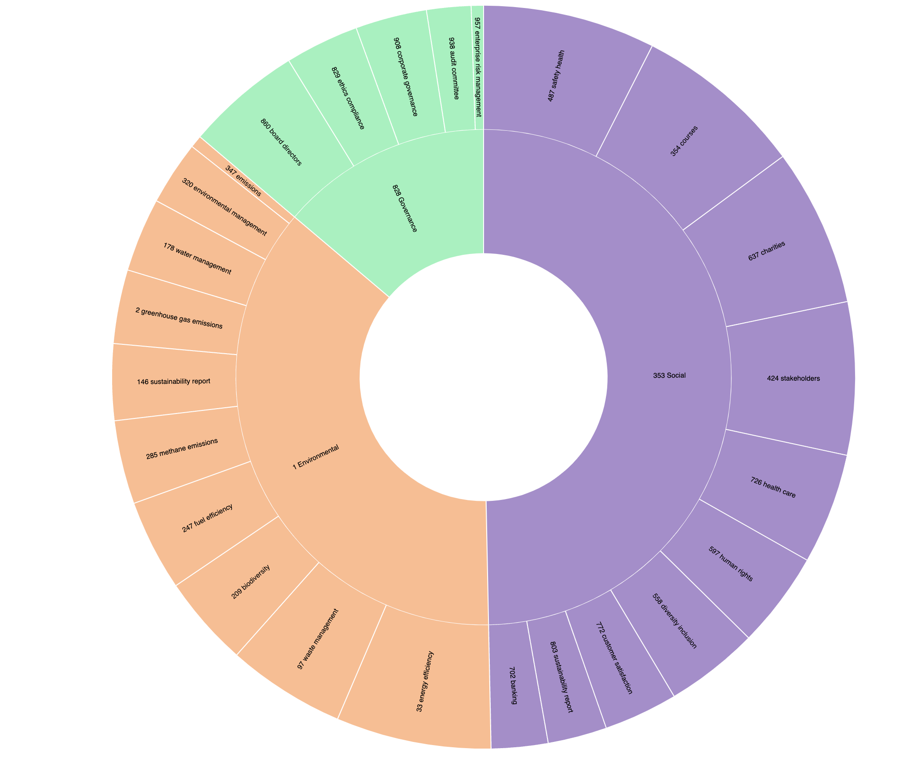
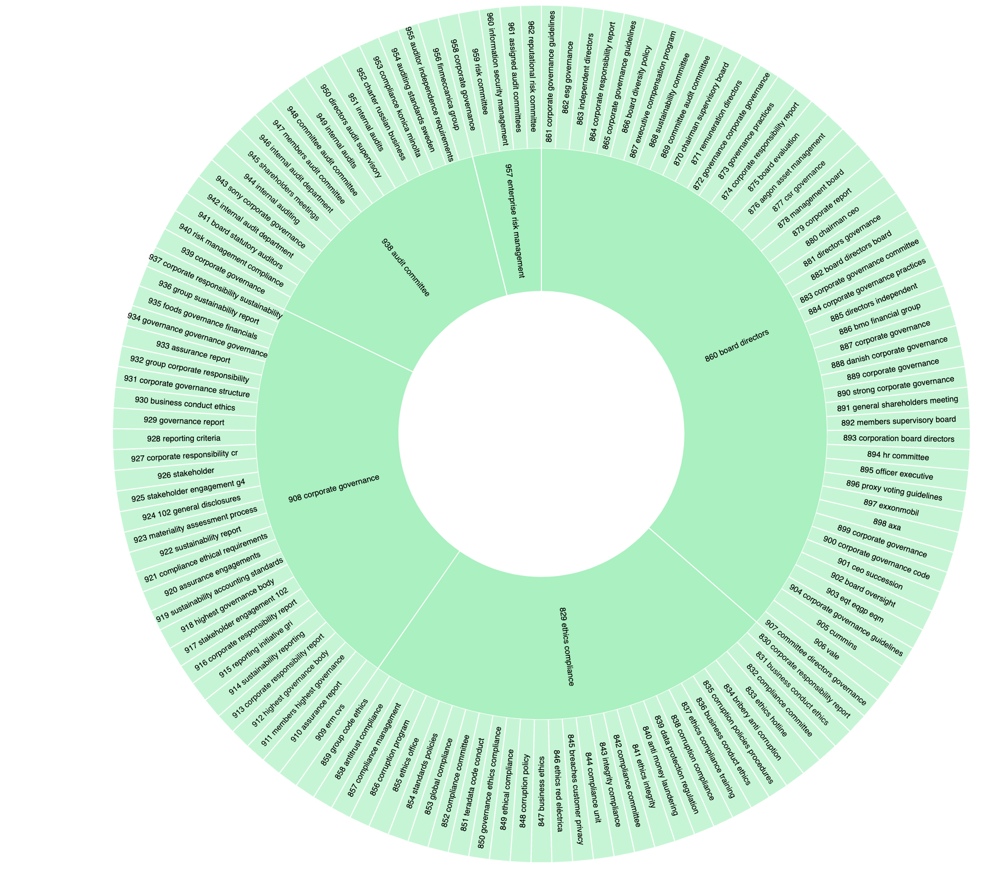
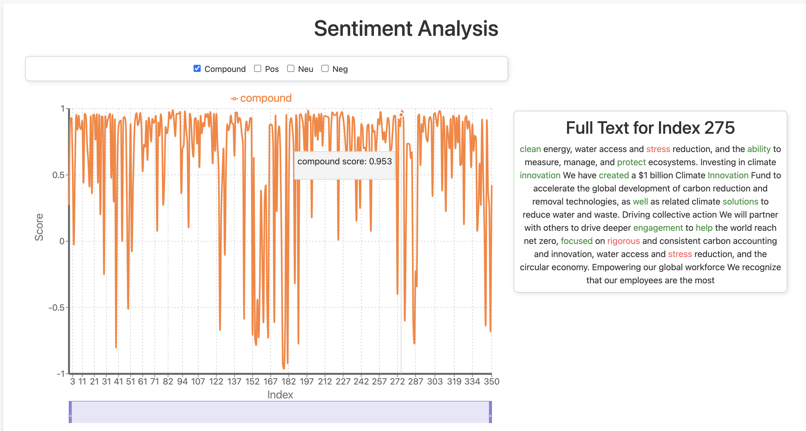
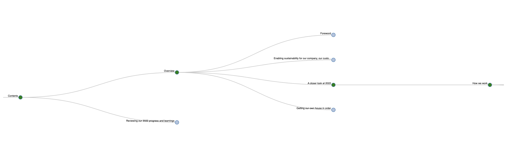
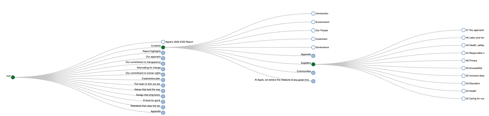
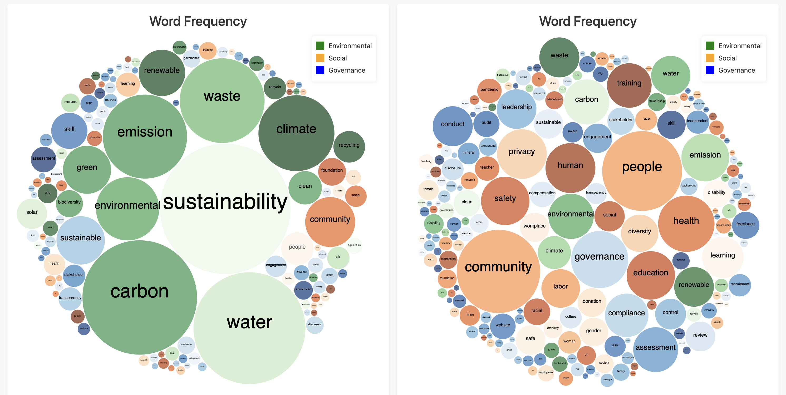
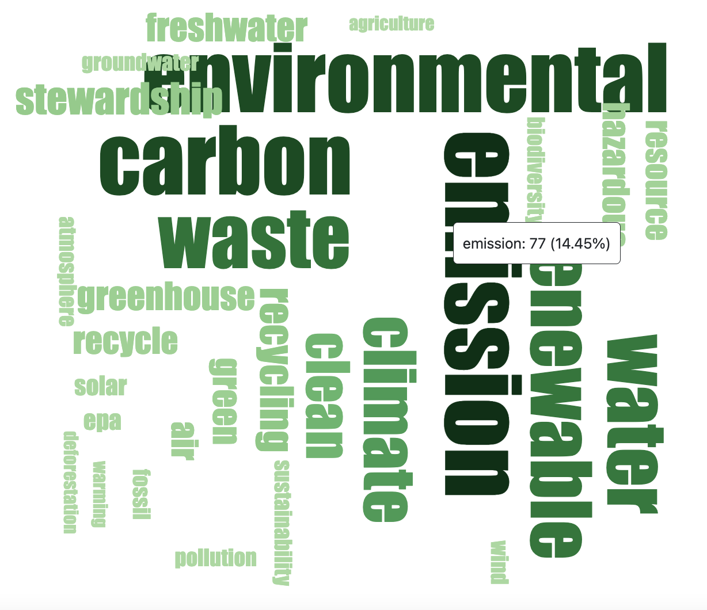
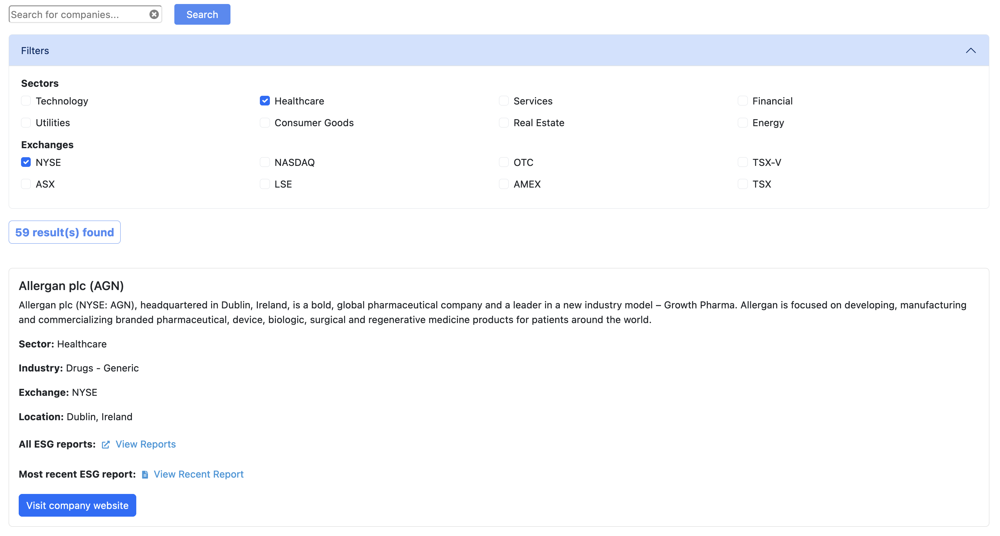

# ESG Demo System for Analyzing and Visualizing Report Data

The main aim of this project was to develop a user-friendly and interactive demo system for ESG report analysis. To accomplish this, the project set out to achieve the following key objectives:

## Interactive User Interface

Design and develop a user interface that facilitates the submission of ESG reports and presents the extracted data in a visually engaging manner. The interface ensures ease of navigation and accessibility for users of varying technical expertise.

## Topic Modelling and Topic Taxonomy Visualisation

### Topic Modelling

Topic modelling is a statistical technique used to uncover abstract themes within a collection of documents. In the context of ESG reports, this feature processes and analyses report content to extract and visualise the predominant topics discussed.

This capability offers users several benefits:
- **Efficiency:** Provides a swift snapshot of a report's primary themes, making it invaluable for time-constrained individuals.
- **Insightful Visualisation:** Displays topics as circles, where size reflects prominence, and proximity indicates relatedness, enabling users to quickly identify dominant themes and their relationships.
- **Comparative Analysis:** Tracks the flow of topics across reports over time, helping users identify evolving priorities or emerging areas of concern.

Additionally, users can view the most common words associated with each topic, their frequency, and specific terms that highlight the nuances of each theme. This enables a deeper understanding of the report's content without needing to parse through the entire document.

### Topic Taxonomy

### Topic Taxonomy

Topic taxonomy extends topic modelling by organising topics into a hierarchical structure. Using ESG report data, this feature arranges topics into parent-child relationships, enabling users to explore thematic connections at different levels of granularity.

Key features of topic taxonomy include:
- **Interactive Sunburst Visualisation:** Topics such as "Environmental," "Social," and "Governance" are displayed as core nodes, with their corresponding subtopics branching out interactively. Users can click on core topics to explore deeper levels of detail.
- **Hierarchical Structure:** Each topic contains child topics, with associated documents linked to multiple topics where applicable (e.g., a document could pertain to both "Biofuels" and "Biodiversity").
- **JSON-Based Data:** The taxonomy is structured as a JSON file, linking topics, their children, and document IDs for efficient data exploration and visualisation.

Although the taxonomy feature was developed on a sample ESG dataset, future work aims to extend functionality for user-uploaded report data.

### Examples:
1. **Topic Modelling Visualisation**  
   

2. **Topic Taxonomy Visualisation 1**  
   

3. **Topic Taxonomy Visualisation 2**  
   

## Sentiment Analysis Visualisation

Understanding the sentiment behind textual content provides invaluable insights into perceptions, opinions, and emotions. To harness this potential, a sentiment analysis feature has been implemented to analyse and visualise the sentiment of text extracted from ESG reports.

The system breaks down the report into manageable sections and evaluates sentiment across four categories: positive, negative, neutral, and compound. Each section is scored, offering a comprehensive view of sentiment distribution throughout the report.

To make the results intuitive and actionable, the sentiment scores are visualised using a multi-line chart. This chart displays sentiment progression over the content. Users can toggle individual sentiment categories on or off to customise their analysis. Additional interactivity includes:

- **Highlighted Context:** Words that contribute most to positive or negative sentiment are highlighted, helping users understand the context behind key sentiment shifts.
- **Slider for Focused Analysis:** A slider allows users to focus on specific sections of the content, enabling detailed comparisons of sentiment variations.
- **Text Display:** The full text corresponding to each section is displayed alongside the chart, providing further context to the visualised sentiment data.

By integrating these features, the sentiment analysis tool empowers users to derive meaningful insights, track sentiment trends, and make data-driven decisions with ease.

### Example:  

1. **Sentiment Analysis Visualisation**  
   

## ESG Report Visualisation

Develop a methodology to provide users with clear, intuitive, and interactive visualisations of the structure and nuanced details of ESG reports.

### Examples:
1. **Report Structure Example 1**  
   

2. **Report Structure Example 2**  
   

## Comparative Analysis

Implement a feature that allows users to compare multiple companies’ ESG reports and commitments side-by-side, highlighting commendations and criticisms of ESG practices.

## ESG Word Frequency Visualisation

This feature aims to visualize the frequency of ESG-related words in reports using two complementary approaches: bubble charts and word clouds.

### Bubble Chart:
The bubble chart provides a panoramic view of the most frequently used words in the ESG report. Bubbles are colour-coded based on their category, offering an immediate visual representation of which aspects of ESG are predominant in a report.

### Word Clouds:
Complementing the bubble chart are three-word clouds, each focused on the Environmental, Social, and Governance sectors. Word clouds emphasize words based on their frequency, with more frequent terms appearing larger and bolder. This allows users to delve deeper into each ESG category, gaining insights into specific areas of emphasis without sifting through dense text.

These visualisation approaches transform voluminous and complex data into digestible, actionable insights. Users can identify key themes and trends almost instantly. Additionally, these tools support comparative analysis—juxtaposing bubble charts or word clouds from different reports can help identify industry trends, shifts in priorities, or company-specific focuses.

### Examples:
1. **Bubble Chart Example**  
   

2. **Environmental Word Cloud Example**  
   

## Company Search and Filter

The ability to efficiently search and filter through a vast data set is crucial for users who are looking for specific information. In the context of this application, this feature is essential given the extensive list of companies and their associated details. The company search feature allows users to quickly locate companies based on various criteria such as name, industry, and exchange. It incorporates a simple text search along with advanced filtering options, enabling users to narrow down their results by specific sectors or exchanges.

### Examples:
1. **Search Functionality**  
   

## Articulating and Exploring System Implications

Assess the demo system's transformative implications for various stakeholders, including investors, regulators, and consumers. Explore its potential to promote transparency and accountability in ESG reporting.
